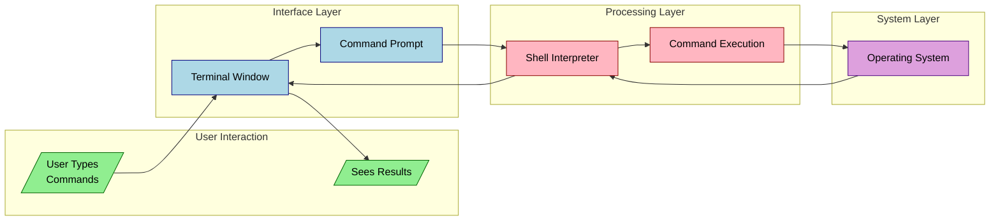

# Command Line Interface
It's basically a way to interface with your computer using text commands. Not to be confused with a TUI. If you're not sure what a command does, add [[202503252200|--help]] (or /? for some windows commands) at the end for help, RTFM, or read the [[202503261633|man page]] or the [[202503262030|info]]] page.

There are three main parts

- **Terminal**: This is the window where you type stuff
- **Command Line**: Where you actually type your commands - it's like the text input box
- **Shell**: The interpreter that processes your commands and communicates with the operating system

## Advantages Over Graphical Interfaces

1. **Efficiency**: Execute complex operations with single commands
2. **Automation**: Easily script repetitive tasks
3. **Resource Usage**: Requires significantly fewer system resources
4. **Precision**: Offers granular control over system operations
5. **Remote Access**: Ideal for managing remote servers and systems

