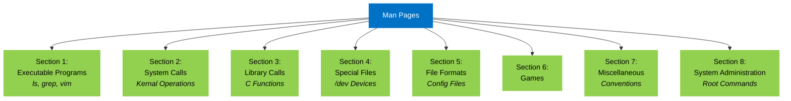

# man page
basically your go-to documentation system in Unix-like operating systems . Think of them as comprehensive instruction manuals built right into your system, accessible anytime without needing internet connectivity.



Each section serves a specific purpose, and you can access them using commands like `man 1 command` for executables or `man 8 command` for system administration tools

### Basic Usage

To check out a man page, just throw this in your terminal:

```bash
man [command]
```

For example, to learn about the `ls` command:

```bash
man ls
```

Pro tip: Use spacebar to page down, 'q' to quit, and arrow keys to scroll line by line.

### Most commonly used sections
•Section 1 (manuals for executable commands)
•Section 5 (manuals about file formats)
•Section 8 (manuals for superuser commands)

### Modern Relevance

Even though we've got Google nowadays, man pages are important because:

1. They work offline
2. They're specific to your exact system configuration
3. They're updated with your system
4. They follow a consistent format across all Unix-like systems
 
Some projects, like Debian, are so serious about documentation that they create man pages for programs that don't even have them.

---------
#### related commands
similarly, `info` works almost the same way as `man`
```bash
info info
```
