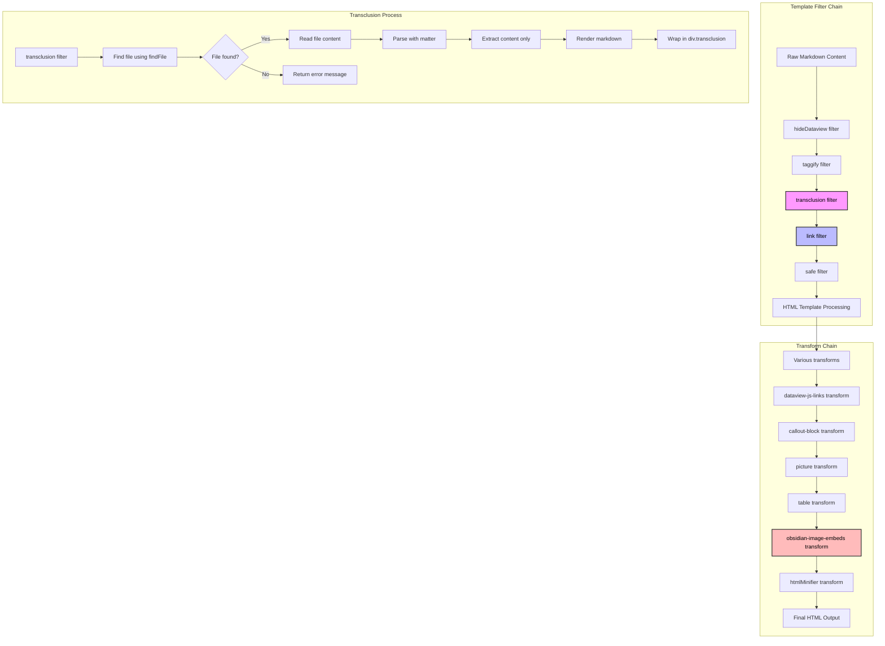

# Fixing Transclusion Link Handling in Eleventy.js

This note documents the process of debugging and fixing an issue with transclusion link handling in the Digital Garden Eleventy setup.

## Problem Statement

Transclusion links using the `![[filename]]` syntax were not being processed correctly. Instead of transcluding the content of the referenced file, they were being rendered as regular internal links.

## Debugging Steps

1. The `link` filter in `.eleventy.js` was modified to prioritize handling transclusion links before other link types. However, this change alone did not resolve the issue, indicating something else was interfering.

2. A `grep` search was performed across the codebase to find other code that might be processing the `![[filename]]` syntax. This revealed that the `obsidian-image-embeds` transform was also capturing these links.

## The scenic path to identifying the *real* problem

initially, I thought that the `obsidian-image-embeds` transform, intended to handle Obsidian-style image links like `![[image.png]]`, had a regular expression that was too broad:

```js
/!\[\[(.*?\.(?:png|jpg|jpeg|gif|svg|webp))\]\]/gi
```

The `(.*?\.` part of this regex was matching any characters up until a dot, even if those characters included square brackets `[]`. This caused it to accidentally match non-image transclusion links like `![[note.md]]`.

Since this transform ran after the `link` filter, it was overriding the transclusion link handling.

## Proposed Solution

To fix this, the regex in `obsidian-image-embeds` was modified to be more specific:

```js
/!\[\[([^[\]]*\.(?:png|jpg|jpeg|gif|svg|webp))\]\]/gi
```

The key change is `([^[\]]*\.` which ensures it only matches filenames without `[]` characters. This prevents it from capturing `![[note.md]]` type links.

After deploying the changes, it turned out this wasn't the issue, because `![[file]]` syntax was being rendered as an internal link, and ignoring the ! symbol. Maybe it's the filters and transforms?

# adding a explicit transclusion filter
 a new `transclusion` filter was created to handle the `![[filename]]` syntax before the `link` filter:

```js
eleventyConfig.addFilter("transclusion", function (str) {
  return (
    str &&
    str.replace(/!\[\[(.*?)\]\]/g, (match, filename) => {
      const filePath = findFile(filename);
      if (filePath) {
        const fileContent = fs.readFileSync(filePath, 'utf8');
        
        // Parse the frontmatter and content
        const parsed = matter(fileContent);
        
        // Render only the content part (excluding frontmatter)
        return `<div class="transclusion">${markdownLib.render(parsed.content)}</div>`;
      } else {
        return `<div class="transclusion-error">Transclusion error: File "${filename}" not found.</div>`;
      }
    })
  );
});
```

The first implementation of this filter exposed the frontmatter of transcluded notes, which was undesirable. This was fixed by using the `matter()` function to parse the file content and extract only the content part (excluding the frontmatter) before rendering it.

## Implementation Details

1. The transclusion filter looks for all occurrences of `![[filename]]` in the content using a regex pattern.
2. For each match, it tries to find the corresponding file using the `findFile` function.
3. If the file is found, it reads the content, parses it using `matter()` to separate the frontmatter from the actual content, and renders only the content part.
4. The rendered content is wrapped in a `<div class="transclusion">` to allow for styling.
5. If the file is not found, it returns an error message.

The templates were also modified to include the transclusion filter in the filter chain:

```njk
{{ content | hideDataview | taggify | transclusion | link | safe}}
```

By placing the `transclusion` filter before the `link` filter, we ensure that all transclusion links are processed first, then any remaining regular links are handled by the `link` filter.

## Key Takeaways

- When multiple pieces of code are processing the same syntax, the order in which they run matters.
- Overly broad regular expressions can lead to unexpected matches. It's important to be as specific as possible.
- Systematic debugging, like searching the full codebase for a pattern, can help uncover issues that may not be immediately apparent.
- When transcluding content, it's important to strip any metadata like frontmatter to avoid exposing internal configuration details.

By understanding how the different parts of the Eleventy config interact and carefully adjusting the regex patterns and filter order, we were able to get the transclusion link handling working as intended, with proper handling of frontmatter.
```javascript
module.exports = function (eleventyConfig) {
  // ... other configuration ...

  // Transclusion transform
  eleventyConfig.addTransform("transclusion", function (content, outputPath) {
    // ... transclusion transform code ...
  });

  // Link filter
  eleventyConfig.addFilter("link", function (str) {
    // ... link filter code ...
  });

  // ... other transforms and filters ...
};
```

# I made charts. everyone loves [[202503272317|charts]]



These charts outline the flow of logic for the transclusion filter, and where it fits in within the broader template filter chain used to generate the final HTML for the site.