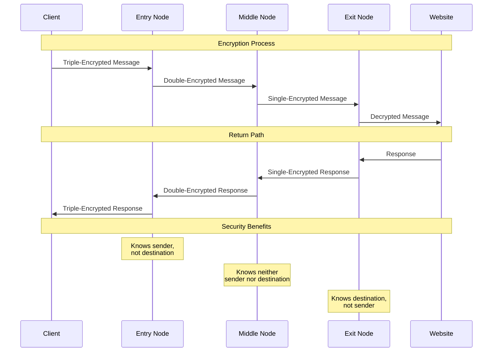

# Tor
## Use Tor 
### Download Tor
### desktop (Windows/Mac/Linux) and Android
[Tor Project | Anonymity Online](https://www.torproject.org/)

### iOS 
[Onion Browser](https://onionbrowser.com/)
[Orbot](https://orbot.app/en/)

* there's a handful of Tor browsers in the appstore but these are actually [endorsed](https://support.torproject.org/tormobile/tormobile-3/) by the Tor Project
* Check their [Github repository](https://github.com/OnionBrowser/OnionBrowser) for documentation
>[!caution]  iOS forces all browsers to use WebKit framework, limiting full Tor protection

## Learn how Onion Routing protects you

- Your data gets wrapped in three layers of encryption
- Each node peels off exactly one layer - they can only see the next hop, nothing else
- Entry Node knows who you are but not where you're going
- Middle Node is just a relay station
- Exit Node sees the destination but has no idea who sent it

### Initial Setup
Launch Tor Browser and you'll hit the connection screen. Choose "Connect" unless you're dealing with censorship or proxy issues. If you're behind a restrictive network, click "Configure" to set up bridges.

>[!info] If you're dealing with heavy censorship
>
>- Use the  [Connection Assist](https://tb-manual.torproject.org/running-tor-browser/) feature to automatically grab a bridge
>- Set up [Pluggable Transports](https://www.linkedin.com/pulse/how-configure-use-tor-browser-securely-comprehensive-guide-denys-spys-6jijf) (obfs4 is solid) 
>- Request custom bridges if the defaults are blocked

### Verification

Make sure it's working:

1. Hit [check.torproject.org](https://check.torproject.org/) to verify your [connection](https://www.linkedin.com/pulse/how-configure-use-tor-browser-securely-comprehensive-guide-denys-spys-6jijf)
2. Run a [DNS leak test](https://www.linkedin.com/pulse/how-configure-use-tor-browser-securely-comprehensive-guide-denys-spys-6jijf) 
3. Check your circuit info by clicking the lock icon

