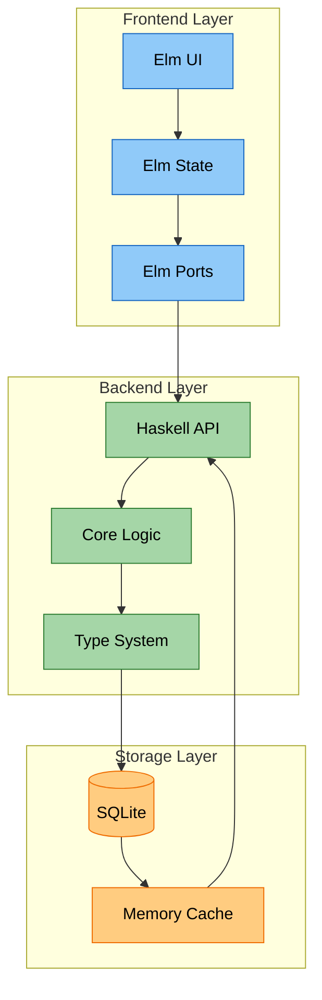

```mermaid
flowchart TD
    classDef frontend fill:#90CAF9,stroke:#1565C0,color:#000
    classDef backend fill:#A5D6A7,stroke:#2E7D32,color:#000
    classDef storage fill:#FFCC80,stroke:#EF6C00,color:#000

    subgraph Frontend["Frontend Layer"]
        UI["Elm UI"]:::frontend
        State["Elm State"]:::frontend
        Ports["Elm Ports"]:::frontend
    end
    
    subgraph Backend["Backend Layer"]
        API["Haskell API"]:::backend
        Logic["Core Logic"]:::backend
        Types["Type System"]:::backend
    end
    
    subgraph Storage["Storage Layer"]
        DB[(SQLite)]:::storage
        Cache["Memory Cache"]:::storage
    end
    
    UI --> State
    State --> Ports
    Ports --> API
    API --> Logic
    Logic --> Types
    Types --> DB
    DB --> Cache
    Cache --> API
```