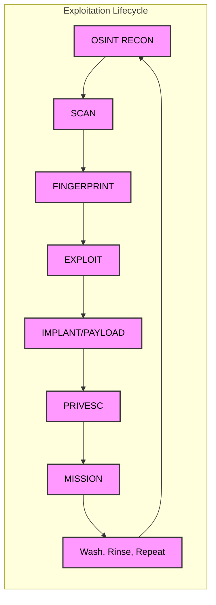

# Exploitation Lifecycle

## OSINT RECON
### Gathering initial intelligence
- Target location identification
- IP space analysis
- Organizational structure mapping
- Personnel information gathering
### Intel Sources
- Passive reconnaissance tools:
    - Search engines (Google, DuckDuckGo)
    - WHOIS lookups
    - Public records
### Technical Tools
- Shodan for network discovery
- Spokeo for personal information
- Seclists for security data
- Project Sonar for internet-wide scanning

### OSINT Information Categories

## Network Infrastructure
>[!info] Network Discovery
> - IP address ranges and network blocks
> - Domain name registrations and history
> - DNS configurations and mail servers
> - Subdomain mappings and forgotten services
> - SSL certificate details and expiration dates

## System Information
>[!warning] System Details
> - Operating system versions and configurations
> - Service banners and response headers
> - Open ports and protocol details
> - Web server software and framework versions
> - Database types and potential vulnerabilities

## Organizational Data
>[!tip] Corporate Intelligence
> - Corporate structure and hierarchy
> - Employee information and roles
> - Physical location details
> - Partner and vendor relationships
> - Merger and acquisition history

## Personnel Information
>[!caution] Personal Data
> - Professional profiles and work history
> - Social media presence and activity patterns
> - Public contact information
> - Conference attendance and presentations
> - Technical skill sets and certifications

## Technical Details
>[!info] Technical Intelligence
> - Code repositories and development practices
> - Technology stack and framework usage
> - API endpoints and documentation
> - Cloud service providers and configurations
> - Security headers and protection mechanisms

## Security-Related Information
>[!warning] Security Intelligence
> - Historical breach data and incidents
> - Known vulnerabilities and patches
> - Security certificate information
> - Exposed administrative interfaces
> - Configuration files in public repositories
## SCANNING
Active Information gathering

### Attack Surface Definition
>[!info] Attack Surface
> "anything open to the public internet that will talk to my application"
>
> - Web servers
> - Mail servers
> - Database servers
> - Phone systems

### Protocol-Based Enumeration
>[!tip] Standard Protocols
> Using standard protocols to enumerate service information:
>
> - Ping for basic host discovery
> - Traceroute for network path analysis
> - DNS queries for name resolution
> - TCP handshake for service verification
> - ARP for local network discovery
> - Telnet for service banner grabbing
> - Netcat for network exploration

### Operational Security Considerations
>[!warning] Detection Risk
> Critical considerations for enumeration:
>
> 1. Proper execution appears as normal service connections
> 2. Poor execution risks triggering:
>    - Antivirus systems
>    - Host-based Intrusion Prevention Systems (HIPS)
>    - Intrusion Detection Systems (IDS)
>    - Firewall rules

### Tool Implementation
>[!info] Primary Tool
> NMAP: cornerstone tool for active information gathering
>
> Note: Not the only option available for enumeration operations
## FINGERPRINTING
### Fingerprinting Methodology

#### Core Purpose
>[!info] Fingerprinting Objective
> Taking scan data further by enumerating specific information
>
> Key questions to answer:
>
> - Open port identification
> - Service verification
> - Version determination
> - Exploit selection criteria
> - Version-specific targeting requirements

#### Technical Focus
>[!tip] Layer Analysis
> Focused on Application layer vs Transport layer
>
> Purpose: develop accurate attack plan
>
> Key considerations:
>
> - Service identification
> - Version compatibility
> - Exploit selection
> - Attack vector development

#### Host Fingerprinting Components
>[!info] Required Information
> Essential data collection:
>
> - Comprehensive port list
> - Service identification per port
> - Precise version information
>
> Action items:
>
> - Build targeted attack plan
> - Map services to vulnerabilities
> - Identify exploit opportunities
> - Develop execution strategy

#### Practical Implementation
>[!warning] Version Considerations
> Critical version analysis:
>
> - Service + version = vulnerability identification
> - Vulnerability mapping to exploits
> - Version-specific exploit selection
> - Attack vector prioritization

#### Example Output
>[!info] SMB Detection
> Real-world implementation:
>
> - OS version identification
> - Service detection
> - Protocol analysis
> - Version-specific targeting

## EXPLOIT
#### Targets
>[!info] Implementation targets:
>
> - Software vulnerabilities
> - Misconfiguration issues
> - Insecure coding practices
> - Hardcoded credentials
> - Hardware vulnerabilities
> - Human factors

#### Operational Risks
>[!warning] Critical Considerations
> Potential dangers:
>
> - System state modification
> - Application crash risk
> - Data loss potential
> - Zero-day exposure
> - TTP revelation risk
## IMPLANT / PAYLOAD
 Delivering malicious code
## PRIVESC
Escalating privileges
## MISSION
Executing objectives

