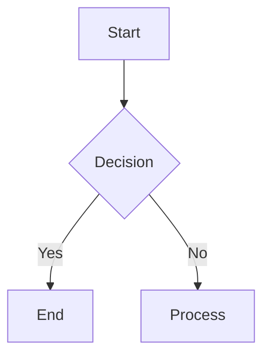

---
{"dg-publish":true,"dg-path":"Daily Notes/2025-03-21","permalink":"/daily-notes/2025-03-21/","noteIcon":"","created":"2025-03-21"}
---
# Cursor and mermaid charts
The Cursor IDE doesn't have mermaid chart support out of the box, but I found [this vs code extension](https://marketplace.cursorapi.com/items?itemName=bierner.markdown-mermaid) that turns this block of mermaid code

```
flowchart TD
    A[Start] --> B{Decision}
    B -->|Yes| C[End]
    B -->|No| D[Process]
```
into this


---------
# Transitioning from supermemo
I have a very large Supermemo knowledge base that I want to incorporate into this digital garden.


 I've been using Supermemo for years as my second brain and knowledge base / knowledge management system, but the inability to use it across devices _seamlessly_ and the horrendous UI kept me on the lookout for alternatives. I might still use it for incremental reading. Supposedly Piotr Wozniak's spaced repetition algorithm is top-tier, but I'm not sure if I would notice the difference if I switched to an FSRS with a modern algorithm (>SM15).

 -----------------

