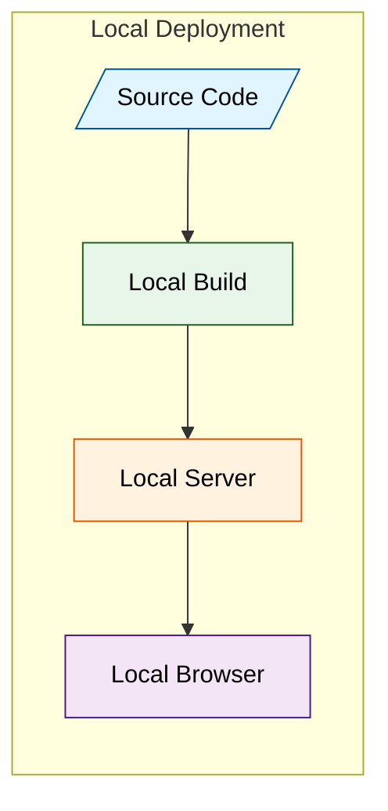

# Vercel limits on the free plan
Turns out I'm limited to 100 deployments a day on  the free plan. Now for a hobbyist that should be plenty, but I actually reached the daily limit a [[Daily Notes/2025-03-22|The other day]] trying to figure out the transclusion issue. 

## I should probably just test the changes locally

