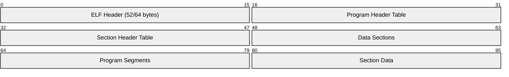

# Norwegian
2:26:00 finish time. Earned the silver badge.
## Components of an ELF File

An ELF (Executable and Linkable Format) file is a standard file format for executables, object code, shared libraries, and core dumps on Unix-like systems. Here's a breakdown of its main components:


**Simplified Visual Representation**

```
+-------------------+
| ELF Header        |
+-------------------+
| Program Header    |  -+
| Table             |   |
+-------------------+   | Loadable segments
| Section 1         |   |
+-------------------+   |
| Section 2         |   |
+-------------------+   |
| ...               |   |
+-------------------+   |
| Section n         |   |
+-------------------+   |
| Section Header    |  -+
| Table             |
+-------------------+
```

**Key Points**

- The ELF header is always at the beginning of the file.
    
- The program header table and section header table are arrays of fixed-size structures.
    
- Sections contain the actual data and code of the program.
    
- Segments, described by the program header table, are a way of grouping sections for loading into memory.
    
- Not all sections are loaded into memory; some are used during linking or debugging.
    
- Tools like `readelf`, `objdump`, and `gdb` can be used to inspect the contents of an ELF file.