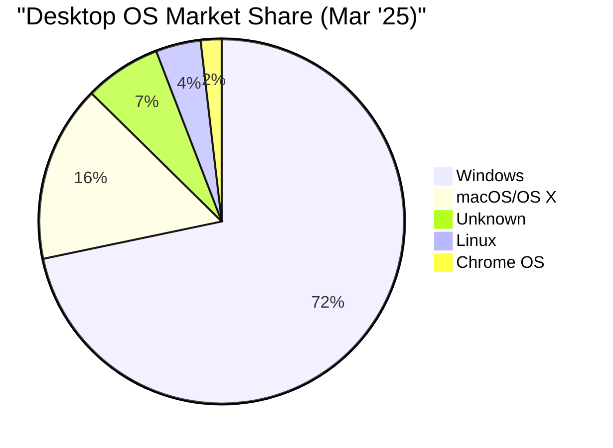

 Windows remains the most widely used desktop operating system, holding a commanding lead in the market.

Windows workstation and server variants share fundamental architectural similarities. Versions with matching numerical designations utilize identical core system components, including kernel images, Hardware Abstraction Layers (HALs), device drivers, system utilities, and Dynamic Link Libraries (DLLs). For example, Windows 10 Workstation and Windows Server 2016 employ virtually indistinguishable underlying architectures.
# Related Topics
[[Enabling scripts in powershell\|Enabling scripts in powershell]]
